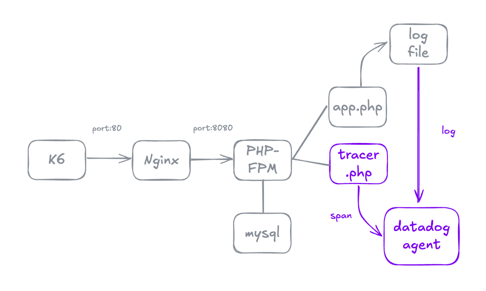
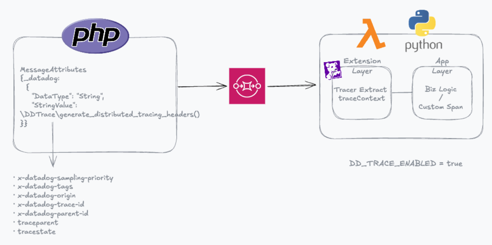

- Require in `.env` file
  - MYSQL_ROOT_PASSWORD
  - MYSQL_DATABASE
  - MYSQL_USER
  - MYSQL_PASSWORD
  - DD_API_KEY

- Usage
```sh
$ docker compose -f compose.yaml up --build
```

- API
  - `db.php`
  
  
  - `sqs_api_dd.php` ※ Require: SQS / Lambda
  